### `$ research`

▸ **Viral discovery and surveillance** — mining RNA-Seq libraries deposited for
entirely different purposes, and reading the viral sequences hiding in them

▸ **Metagenomics and viral diversity** — across plants, arthropods and
fermentation-associated microbial communities

▸ **Endogenous viral elements and small RNAs** — ancient viral integrations in
bee genomes, and the small RNA pathways that keep them quiet

▸ **Plant immunity** — resistance genes in *Theobroma cacao* and their
expression under infection

### `$ cat publications.bib`

Cocoa viromes, bee endogenous viral elements, stingless bee miRNAs and the
ViralQuest pipeline — the full list lives at
[gabrielvpina.github.io/publications](https://gabrielvpina.github.io/publications/).

